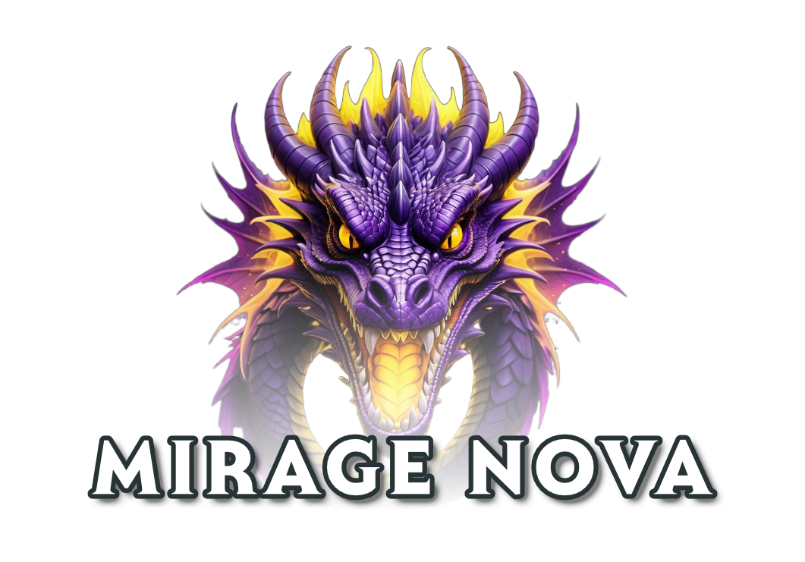

<div align="center">
    


</div>

---

**Mirage Nova** is a 2D game development engine written in Go (Golang), specifically designed for creating small-scale online multiplayer role-playing games.

It leverages Go's powerful concurrency model to enable efficient and scalable networking.

## Features

- Player account management and login system
- Account management with multiple characters per account
- Real-time multiplayer communication with efficient TCP networking
- NPC spawning, movement, and interactions
- Basic combat mechanics
- Item inventory system with support for trading and equipping items
- Experience and leveling system for player progression
- In-game chat system (global, private, and local)

## Build Instructions

### Clone the repository
```bash
git clone https://github.com/Guthius/mirage-nova.git
cd mirage-nova
```

### Install Go

Ensure that [Go](https://golang.org/dl/) is installed on your system. The minimum required version of Go is 1.23.

You can verify the installation by running:
```bash
go version
```

### Build the server

Navigate to the server directory and build the server:
```bash
cd server
go build -o ../bin/
```

### Run the server

Execute the built server binary:
```bash
cd ../bin
./server
```

## Legacy

The Mirage Nova Engine represents a significant step forward from its predecessor, the VB6-based Mirage Engine, by embracing modern technologies and best practices.

Mirage Nova is based on the Lite 2D Version of the VB6 Mirage Engine available at [https://mirage-engine.uk/](https://mirage-engine.uk/).

## License

This project is licensed under the MIT License. For the complete license text, please refer to the [LICENSE](LICENSE) file.